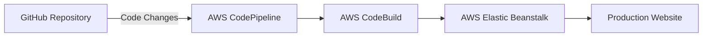

# Resume Website CI/CD Pipeline Documentation

## Architecture Overview



## Infrastructure Components

1. **Source Control**: GitHub
   - Repository contains:
     - `index.html`: Main resume page
     - `resume.png`: Resume image
     - `.gitignore`: Git ignore file

2. **CI/CD Pipeline**: AWS CodePipeline
   - Automatically triggers on GitHub commits
   - Three stages: Source, Build, Deploy

3. **Build Service**: AWS CodeBuild
   - Uses `buildspec.yml` for build configuration
   - Processes static files for deployment

4. **Hosting Platform**: AWS Elastic Beanstalk
   - PHP platform for static file serving
   - Handles environment management and scaling

## Setup Instructions

### 1. GitHub Repository Setup
1. Create a new repository
2. Add website files:
   ```bash
   - index.html
   - resume.png
   - .gitignore
   ```

### 2. AWS Elastic Beanstalk Environment
1. Create new application
   - Platform: PHP
   - Create environment
   - Choose "Sample application" for initial setup

### 3. AWS CodeBuild Configuration
1. Create build project
2. Add `buildspec.yml`:
   ```yaml
   version: 0.2
   phases:
     build:
       commands:
         - echo "No build steps required for static files"
   artifacts:
     files:
       - '**/*'
     base-directory: '.'
   ```

### 4. AWS CodePipeline Setup
1. Create new pipeline
2. Configure source stage:
   - Source provider: GitHub
   - Connect to your repository
3. Configure build stage:
   - Build provider: AWS CodeBuild
   - Select your build project
4. Configure deploy stage:
   - Deploy provider: AWS Elastic Beanstalk
   - Select your application and environment

## Maintenance Guide

### Regular Maintenance Tasks
1. **Monitor Pipeline Executions**
   - Check CodePipeline console regularly
   - Review build and deployment logs

2. **Cost Optimization**
   - Review AWS resource usage
   - Monitor Elastic Beanstalk instance sizing

### Troubleshooting Guide

1. **Pipeline Failures**
   - Check CodePipeline execution details
   - Review CodeBuild logs for build failures
   - Verify Elastic Beanstalk health status

2. **Common Issues and Solutions**
   - Build Failures:
     - Verify buildspec.yml syntax
     - Check file permissions
   - Deployment Failures:
     - Review Elastic Beanstalk environment health
     - Check application logs

3. **Website Access Issues**
   - Verify Elastic Beanstalk environment status
   - Check security group configurations
   - Review application logs

## Security Considerations

1. **Access Management**
   - Use IAM roles with least privilege
   - Regularly review and rotate access keys
   - Monitor AWS CloudTrail logs

2. **Repository Security**
   - Enable branch protection rules
   - Implement code review process
   - Scan for sensitive information

## Disaster Recovery

1. **Backup Procedures**
   - Repository is version controlled in GitHub
   - Elastic Beanstalk environment can be recreated

2. **Recovery Steps**
   - Create new Elastic Beanstalk environment if needed
   - Redeploy from last successful build
   - Update DNS if necessary

## Resource Cleanup

To avoid unnecessary AWS charges:
1. Delete Elastic Beanstalk environment
2. Delete CodePipeline pipeline
3. Delete CodeBuild project
4. Remove any unused IAM roles

## Support and Documentation

- [AWS Elastic Beanstalk Documentation](https://docs.aws.amazon.com/elasticbeanstalk/)
- [AWS CodePipeline Documentation](https://docs.aws.amazon.com/codepipeline/)
- [AWS CodeBuild Documentation](https://docs.aws.amazon.com/codebuild/)